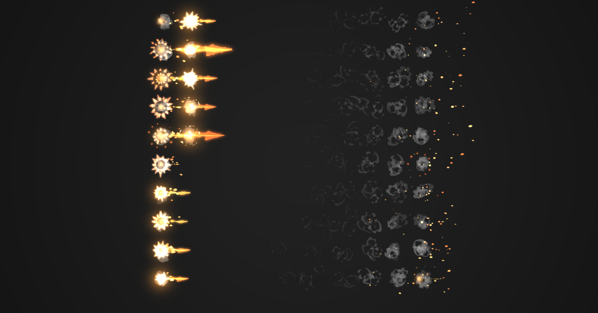

# three.quarks
[![][npm]][npm-url]
[![][github-star]][github-url]
[![][build-size]][build-size-url]
[![][npm-downloads]][npmtrends-url]
[![][discord]][discord-url]

[**three.quarks**](https://quarks.art/) is a high-performance javascript particle system based visual effect library for threejs
 written in modern **TypeScript**.
 
 Join our discord for discussion.



## Links

- [Official Website](https://quarks.art/)
- [Code of Conduct](./CODE_OF_CONDUCT.md)
- [Contributing Guide](./CONTRIBUTING.md)
- [Development Guide](./DEVELOPMENT_GUIDE.md)
- [Demo](https://alchemist0823.github.io/three.quarks/)
- [Change Log](./CHANGELOG.md)
- [Sandbox Example](https://codesandbox.io/s/three-quarks-atom-particle-system-xp3fvz?file=/index.html)
- [Three Fiber Example](https://codesandbox.io/s/three-quarks-with-react-three-fiber-llhvxk)

## Background
 [three.quarks](https://github.com/Alchemist0823/three.quarks) is a high-performance general-purpose particle
  system library with a WYSIWYG visual editor 
  [three.quarks-editor](https://quarks.art/create) for it. It runs on 
top of the well-known WebGL library called [three.js](https://threejs.org).

## Roadmap
- Port Simulation Compiler code to Rust
- WebAssembly Particle Simulation on CPU. (WIP)
- GPU simulation on GPU (WIP)
- Node based / scriptable particle system (WIP)
- Simulation Frequency - Performance
- Unity / Standalone Cross-platform Native plugin to run VFX

## Features
- Semi-compatible Unity (shuriken) Particle system
- Support Mesh Standard Material and Mesh Basic Material 
- Batch Render Multiple Particle System (reduce draw calls) - [BatchedParticleRenderer](https://github.com/Alchemist0823/three.quarks/tree/master/src/BatchedParticleRenderer.ts)
- Emission Shape and Control
  - Mesh Surface Emitter
- Plugin System - [Plugin](https://github.com/Alchemist0823/three.quarks/tree/master/src/Plugin.ts)
  - Customizable Behaviors
  - Customizable Emitter Shape
- 4 Type of renderer
  - Billboard
  - Stretched Billboard
  - Mesh Renderer
  - Trail Renderer [TrailBatch](https://github.com/Alchemist0823/three.quarks/tree/master/src/TrailBatch.ts)
- Spawn Particle on Mesh Surface
- Configuable RenderMode and BlendMode
- 1D Bézier curve function for adjusting
- Texture Atlas Animation
- User Extension and Customization
- A realtime editor to test and create visual effects [three.quarks-editor](https://github.com/Alchemist0823/three.quarks-editor)
- VFX json load and save 

three.quarks computes most particle information on CPU, and it uses customized shader
, instancing, batch techniques to render those particles with as few draw calls as possible. 
three.quarks supports one dimension piecewise Bézier curves for the customizable transform
visual effect. Most importantly, developers can customize how the particle system works 
by adding their own Behavior.

### Install
#### Package install
```bash
npm install three.quarks
```

### Check [examples](./packages/three.quarks/examples) folder

Add particle system to the scene

```javascript
const clock = new THREE.Clock();
const batchSystem = new BatchedRenderer();
const texture = new TextureLoader().load("atlas.png");
// Particle system configuration
const muzzle = {
    duration: 1,
    looping: false,
    startLife: new IntervalValue(0.1, 0.2),
    startSpeed: new ConstantValue(0),
    startSize: new IntervalValue(1, 5),
    startColor: new ConstantColor(new THREE.Vector4(1, 1, 1, 1)),
    worldSpace: false,

    maxParticle: 5,
    emissionOverTime: new ConstantValue(0),
    emissionBursts: [{
        time: 0,
        count: new ConstantValue(1),
        cycle: 1,
        interval: 0.01,
        probability: 1,
    }],

    shape: new PointEmitter(),
    material: new MeshBasicMaterial({map: texture, blending: AdditiveBlending, transparent: true}),
    startTileIndex: new ConstantValue(91),
    uTileCount: 10,
    vTileCount: 10,
    renderOrder: 2,
    renderMode: RenderMode.Mesh
};

// Create particle system based on your configuration
muzzle1 = new ParticleSystem(muzzle);
// developers can customize how the particle system works by 
// using existing behavior or adding their own Behavior.
muzzle1.addBehavior(new ColorOverLife(new ColorRange(new THREE.Vector4(1, 0.3882312, 0.125, 1), new THREE.Vector4(1, 0.826827, 0.3014706, 1))));
muzzle1.addBehavior(new SizeOverLife(new PiecewiseBezier([[new Bezier(1, 0.95, 0.75, 0), 0]])));
// texture atlas animation
muzzle1.addBehavior(new FrameOverLife(new PiecewiseBezier([[new Bezier(91, 94, 97, 100), 0]])));
muzzle1.emitter.name = 'muzzle1';
muzzle1.emitter.position.x = 1;

batchSystem.addSystem(muzzle1);

// Add emitter to your Object3D
scene.add(muzzle1.emitter);
scene.add(batchSystem);
```

Add batch renderer update in your main loop

```javascript
// update batched renderer
batchSystem.update(clock.getDelta());
```

#### Import VFX JSON

```javascript
const batchSystem = new BatchedRenderer();
const loader = new QuarksLoader();
loader.setCrossOrigin("");
loader.load(jsonURL, (obj) => {
    // the API uses manuel loading because users may need to 
    // store the VFX somewhere to reuse it later.
    QuarksUtil.addToBatchRenderer(obj, batchRenderer);
    scene.add(obj);
}, () => {
}, () => {
});
scene.add(batchSystem);
```

#### Play multiple instances of loaded effect

```javascript
const effect = loadedEffect.clone(true);
scene.add(effect);
QuarksUtil.setAutoDestroy(effect, true);
QuarksUtil.addToBatchRenderer(effect, batchSystem);
// if you want to stop the effect animation at the beginning you could run pause
QuarksUtil.pause(effect);
QuarksUtil.play(effect);
```

Note: the texture url reference is defined by the texture's name field.
you may need to modify the texture url in json as needed.

#### Export VFX JSON
```javascript
JSON.stringify(muzzle1.emitter.toJSON())
JSON.stringify(muzzle1.emitter.parent.toJSON())
```

## Examples

Launch Examples

```bash
npm install             # install dependencies
npm run build           # build three.quarks
npm run example         # start an HTTP server to serve example particle effects
```

### three.quarks-editor

three.quarks-editor can help you preview a set of particle system at once.
 and you can also adjust all the particle system at real time and export those system
  as a JSON file. Your app or game can load those JSON file later. It even includes a 
  Javascript scripting system to test those effect in a similar environment to your 
  application.


### Tests
Check [test](./packages/three.quarks/test) folder

More examples will come up later.

### Notes

<s>
If you want the best performance please consider `yarn link` [https://github.com/Alchemist0823/three.js](https://github.com/Alchemist0823/three.js).
This version of three.js performs much better than official release, because it avoids unnecessary `getProgramCachedKey()` calls and material updates.
</s>

[github-star]: https://img.shields.io/github/stars/Alchemist0823/three.quarks.svg?style=social
[github-url]: https://github.com/Alchemist0823/three.quarks
[npm]: https://img.shields.io/npm/v/three.quarks
[npm-url]: https://www.npmjs.com/package/three.quarks
[build-size]: https://badgen.net/bundlephobia/minzip/three.quarks
[build-size-url]: https://bundlephobia.com/result?p=three.quarks
[npm-downloads]: https://img.shields.io/npm/dw/three.quarks
[npmtrends-url]: https://www.npmtrends.com/three.quarks
[discord]: https://img.shields.io/discord/1042342883056963664
[discord-url]: https://discord.gg/5Tv3kJCrQZ
